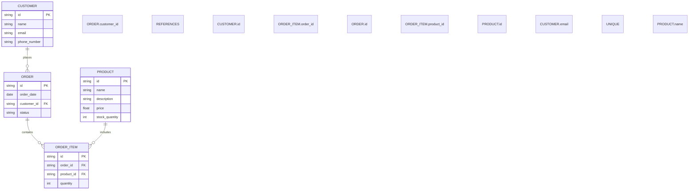

# ER Diagram Artifact

```mermaid
erDiagram
    CUSTOMER {
        string id PK
        string name
        string email
        string phone_number
    }
    ORDER {
        string id PK
        date order_date
        string customer_id FK
        string status
    }
    PRODUCT {
        string id PK
        string name
        string description
        float price
        int stock_quantity
    }
    ORDER_ITEM {
        string id PK
        string order_id FK
        string product_id FK
        int quantity
    }

    CUSTOMER ||--o{ ORDER : places
    ORDER ||--o{ ORDER_ITEM : contains
    PRODUCT ||--o{ ORDER_ITEM : includes

    ORDER.customer_id REFERENCES CUSTOMER.id
    ORDER_ITEM.order_id REFERENCES ORDER.id
    ORDER_ITEM.product_id REFERENCES PRODUCT.id

    CUSTOMER.email UNIQUE
    PRODUCT.name UNIQUE
```

## Generated Diagram

